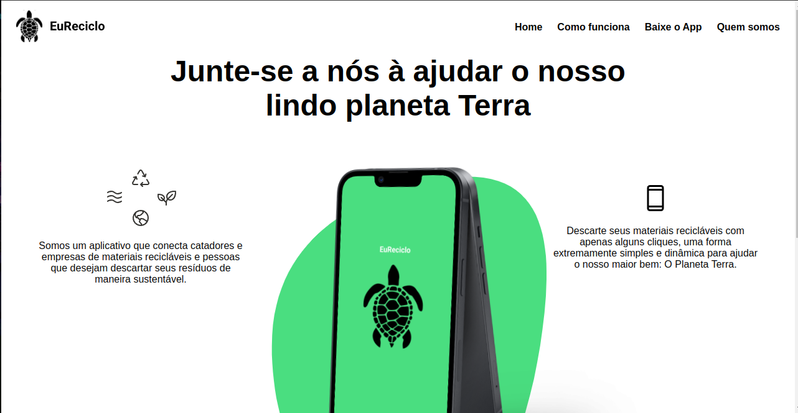

### Atividade Extensionista - UNINTER - 2023
### ***Atividade Extensionista - EuReciclo(Site de divulgação do APP)***

#### Sobre o desafio:
 * A Atividade Extensionista visa desenvolver uma solução tecnológica que ajude pessoas ou o mundo. O EuReciclo tem como objetivo ajudar a cidade na coleta de materiais recicláveis de forma simples e rápida, esse repositório é o site de divulgação do aplicativo mobile.




### Principais tecnologias usadas no desenvolvimento:

* TypeScript
* Vite
* Styled-Components

### Bibliotecas em destaque:

* react-router-dom
* Styled-components
* framer-motion


### Link vídeo do projeto no Youtube:

<a href="https://youtu.be/NxV8_aiaqxk" aria-label="Link Design Figma" target="_blank">

</a>

### Portas da aplicação:

- ***Front-end*** está rodando em: http://localhost:5173

### Configuração do Front-end:

1. Entre na pasta Site-Eu-Reciclo;
2. Use o comando: ***yarn*** ou ***npm install/i*** para instalar os pacotes;


### Passo-a-passo para rodar a aplicação:

1. Entre na pasta Site-Eu-Reciclo;

3. Use um dos comandos abaixo para rodar a aplicação:

```bash
npm run dev
# or
yarn dev
# or
pnpm dev
